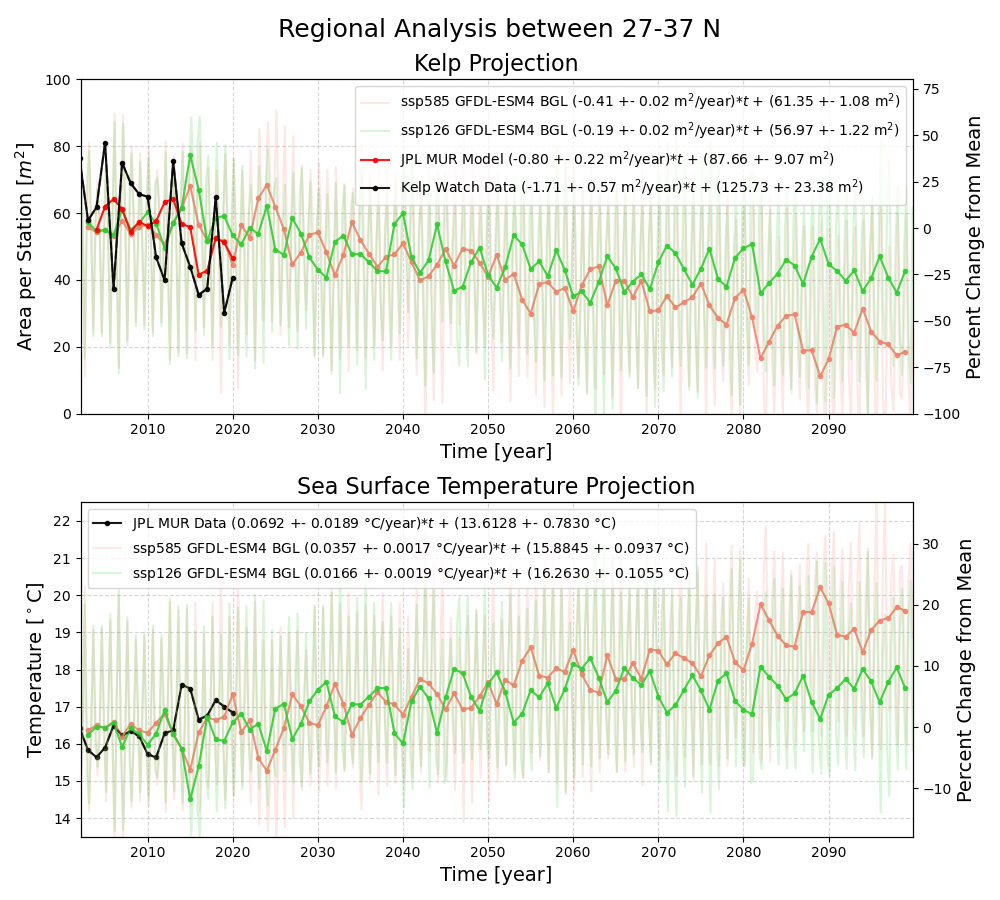
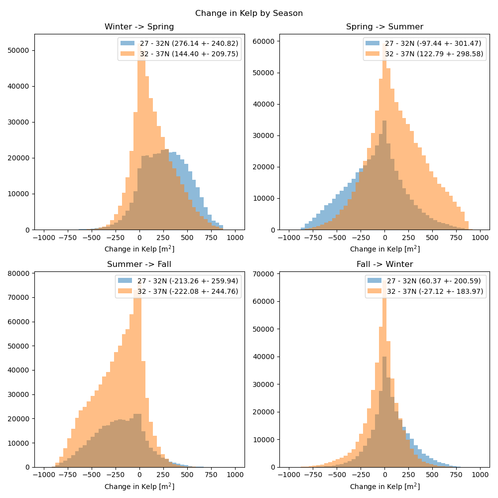
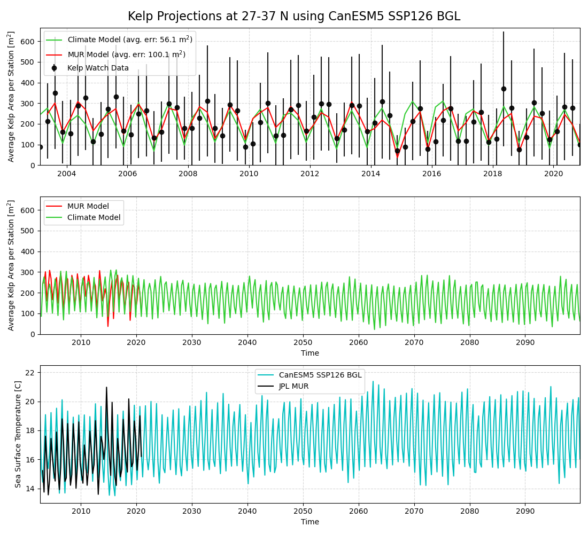

# Kelp-Forest-Projection 🌊💚📈

[](https://colab.research.google.com/drive/1LbxwNnBsqL-zboR4_Et9q6sPTX6-3dn_?usp=sharing)
[](https://hf.co/chat/assistant/66d5e5ccd4c00cc8ff445e33)


**An ecological forecasting model to track & predict kelp biomass availability along California's coastlines**




## Installation + Setup

1) Clone repo + setup a conda environment

```
conda create -n kelp python=3.10
conda activate kelp
conda install ipython jupyter pandas matplotlib scipy scikit-learn
conda install -c conda-forge xarray dask netCDF4 bottleneck
pip install tqdm statsmodels astropy
```

2) Or if you prefer docker:

```
# build image
docker build -t kelp .

# launch a jupter lab server from the container
./lab.sh 8008
```

## Example

`Regression_quick.ipynb` is a notebook that demonstrates how to train a regression model to predict the abundance of kelp using various features like temperature, sunlight, and time. The notebook also shows how to use the trained model to predict the abundance of kelp using features from a simulation data set. If you want to remake the data used for the regression model, you can run the notebook, `downscale_kelp_to_mur_grid.ipynb`. We recommend running this on our shared collaboration server since the data files are already available there, https://oss.ecopro.smce.nasa.gov/hub/user-redirect/lab/tree/efs/tools/Kelp_Biomass/downscale_kelp_to_mur_grid.ipynb 

Anytime you want to start a new analysis the first thing will be to format and clean the input data. This includes interpolating the MUR SST data onto the same grid as the kelp data and calculating various metrics like lag temperatures and derivatives for each kelp location. 

1. `create_interpolated_sst.py` - Interpolate the monthly SST data onto the same grid as the kelp data and create a new file called: `kelp_interpolated_data.pkl`

2. `kelp_metrics.py` - Calculate various metrics like lag temps and derivatives for each kelp location then save the data to a new file called: `kelp_metrics.pkl`. These metrics are used as features for our regression algorithm.

3. `regressors_train.py` - Train various regression models to predict the abundance of Kelp using ordinary least-squares, multi-layer perceptron and random forest with features from `kelp_metrics.pkl`.

4. `regressors_predict.py` - Use the trained regression models to predict the abundance of Kelp using features from `kelp_metrics_sim.pkl`. This is to compare to various simulation data sets.

## Analysis Scripts

| Script Name | Description | 
| ----------- | ----------- |
| `create_interpolated_sst.py` | Interpolate the monthly SST data onto the same grid as the kelp data and create a new file called: `kelp_interpolated_data.pkl` |
| `create_interpolated_sst_sim.py` | Interpolate the simulated monthly SST data onto the same grid as the kelp data(quarterly) and create a new file called: `kelp_interpolated_data_sim.pkl`   |
| `kelp_metrics.py` | Calculate various metrics like lag temps and derivatives for each kelp location then save the data to a new file called: `kelp_metrics.pkl`. These metrics are used as features for our regression algorithm. |
| `Notebooks/plot_downscaled_kelp.ipynb` | Visualize a small section of downscaled data.  |
| `plot_map.py`  | Create a map of the kelp locations and sea surface temperatures. | 
|  |  |
| `plot_timeseries.py` | Create time series plots for temperature and abundance using `kelp_metrics.pkl`, averages over the entire region. 
|  |  |
| `plot_histogram_sst.py` `plot_histogram_kelp.py`   | Create seasonal histograms for change in abundance using `kelp_metrics.pkl`, averages over the entire region. |
|  |  |
| `plot_lag_correlation.py` `plot_lag_correlation_change.py` | Create lag correlation plots for temperature and abundance using `kelp_metrics.pkl`, averages over the entire region. |
|  |  |
| `overplot_timeseries.py` | Create time series plots for temperature and kelp using `kelp_metrics.pkl`, overplots 3 different regions. |
| |  | |
| `overplot_histogram.py` | Create seasonal histograms for change in abundance and SST using `kelp_metrics.pkl`, overplots 3 different regions. |
|  |  |
| `trends_annual.py` | Calculate the annual trends for kelp abundance and temperature using `kelp_metrics.pkl`. Also, measures significance of trends with various pval estimates (e.g. pearsonr, Mann-Kendall, Kendall-Tau, ANOVA, Spearmanr, etc.) |
|  |  |
| `trends_quarterly.py` | Calculate the seasonal trends (quarterly) for kelp abundance and temperature using `kelp_metrics.pkl`. Also, measures significance of trends with various pval estimates (e.g. pearsonr, Mann-Kendall, Kendall-Tau, ANOVA, Spearmanr, etc.) |
| | Trend with previous quarter's temperature  | 
| `regressors_optimize.py` | Hyperparameter optimization for regression algorithms using scikit-learn | 
| `regressors_train.py` | Train various regression models to predict the abundance of Kelp using ordinary least-squares, multi-layer perceptron and random forest with features from `kelp_metrics.pkl`. |
|  |  |
| `regressors_predict.py` |  Use the trained regression models to predict the abundance of Kelp using features from `kelp_metrics_sim.pkl`. |
| |  | 
| `overplot_projection.py` | Overplot the projections from the regression models using features from `kelp_metrics_sim.pkl`. |
| |  |


## Data Files

1) Download the kelp data from the [Kelp Watch](https://kelpwatch.org/) website. The data is stored in a netCDF file and contains the kelp canopy area in square meters for each location along the coast. The data is stored in the `Data/` directory and is used to calculate the kelp metrics.

2) Download the sea surface temperature data from the [JPL MUR SST](https://podaac.jpl.nasa.gov/dataset/MUR-JPL-L4-GLOB-v4.1) website. The data is stored in a netCDF file and contains the sea surface temperature in degrees Celsius for each location along the coast. The data is stored in the `Data/` directory and is used to calculate the kelp metrics.

3) Download the digital elevation model data from the [GEBCO](https://www.gebco.net/data_and_products/gridded_bathymetry_data/) website. The data is stored in a netCDF file and contains the elevation in meters for each location along the coast. The data is stored in the `Data/` directory and is used to calculate the kelp metrics.

4) Download the digital elevation model data from the [NOAA](https://www.ncei.noaa.gov/products/coastal-relief-model) website. The data is stored in a netCDF file and contains the elevation in meters for each location along the coast. The data is stored in the `Data/` directory and is used to calculate the kelp metrics.

If you can't find the data files, sign up for account on our shared Jupyter Hub server and download the data from the `Data/` directory. [https://oss.ecopro.smce.nasa.gov/hub]()

# Tests for statistical significance

| Annual P-Vals | SST vs. Kelp | Time vs. SST | Time vs. Kelp |
|--------------|--------------|--------------|--------------|
| [Pearsonr](https://docs.scipy.org/doc/scipy/reference/generated/scipy.stats.pearsonr.html)    | 0.149        | 0.001        | 0.053        |
| [Kendalltau](https://docs.scipy.org/doc/scipy/reference/generated/scipy.stats.kendalltau.html)  | 0.164        | 0.000        | 0.080        |
| [Spearmanr](https://docs.scipy.org/doc/scipy/reference/generated/scipy.stats.spearmanr.html)   | 0.198        | 0.000        | 0.058        |
| [Mann.Kendall](https://docs.scipy.org/doc/scipy/reference/generated/scipy.stats.mstats.kendalltau.html) | 0.164        | 0.000        | 0.080        |
| [Linregress](https://docs.scipy.org/doc/scipy/reference/generated/scipy.stats.linregress.html)  | 0.149        | 0.001        | 0.053        | 

Signficant trends occur when p-vals are less than ~0.05-0.1, where smaller values are more significant. These values are measured in the `trends_annual.py` script.

| Quarterly P-vals| SST vs. Kelp | Time vs. SST | Time vs. Kelp |
|-----------------|--------------|--------------|---------------|
| Pearsonr        | 0.008        | 0.016        | 0.557         |
| Kendalltau      | 0.083        | 0.016        | 0.493         |
| Spearmanr       | 0.038        | 0.013        | 0.434         | 
| Mann.Kendall    | 0.083        | 0.016        | 0.493         |
| Linregress      | 0.008        | 0.016        | 0.557         |

One thing these tables don't show is the direction of the correction but from the quarterly plots above we see an inverse trend between Kelp and SST from a quarter before. The trend implies some at some temperature around ~22C the kelp abundance reaches 0.

| Quarterly P-vals | SST_lag vs. Kelp | Time vs. SST_lag | Time vs. Kelp |
|------------------|------------------|------------------|--------------|
| Pearsonr         | 0.000            | 0.059            | 0.557        |
| Kendalltau       | 0.000            | 0.031            | 0.493        |
| Spearmanr        | 0.000            | 0.028            | 0.434        |
| Mann.Kendall     | 0.000            | 0.031            | 0.493        |
| Linregress       | 0.000            | 0.059            | 0.557        |

# Temperature vs. Kelp Abundance per Region

The largest correlations with kelp abundace are the temperatures with a one quarter lag. The kelp decreases to 0 at an average temperature of ~26 C. 

TODO: re-do this analysis by running `plot_lag_correlation.py` on different regions, then compare the results.

# Predictions with Machine Learning

We test three different regression algorithms to predict the abundance of kelp: ordinary least-squares, multi-layer perceptron and random forest. The regressors are trained using the features from `kelp_metrics.pkl` and the target variable is the abundance of kelp. The regressors are trained using the `regressors_train.py` script.

|                      | Correlation Coefficient | Mutual Information | Feature Importance |
| -------------------- | ----------------------- | ------------------ | ------------------ |
| Time                 |  -0.032 | 0.155 | 0.027 |
| Elevation [m]        | 0.040   | 0.013 | 0.000 |
| Sunlight [day]       | 0.304   | 0.186 | 0.690 |
| Latitude             | 0.116   | 0.098 | 0.000 |
| Longitude            | -0.164  | 0.103 | 0.000 |
| Temperature          | 0.005   | 0.391 | 0.000 |
| Temperature Lag      | -0.314  | 0.420 | 0.199 |
| Temperature Lag 2    | -0.172  | 0.401 | 0.084 |


Even though the parameters individually may be correlated to the amount of kelp, the random forest regression model suggests only the amount of sunlight, temperature from the previous quarter and time are important for making a prediction. Making another model with only these features may be more accurate than includes features like elevation, latitude, longitude, etc.

|                         | Correlation Coefficient | Mutual Information | Feature Importances |
|-------------------------|-------------------------|--------------------|---------------------|
| Time                    | -0.042                  | 0.155              | 0.020               |
| Sunlight [day]          | 0.304                   | 0.186              | 0.702               |
| Temperature Lag         | -0.314                  | 0.420              | 0.194               |
| Temperature Lag 2       | -0.172                  | 0.401              | 0.085               |


### How to create a projection from new simulation data:

Follow these steps to create a new linear regression model from Kelp Watch + MUR SST values and then project the model onto new simulation data.

1) Download the temperature file to `Data/`

2)	Interpolate + reformat simulation data onto same grid as Kelp

    `python create_interpolated_sst_sim.py -c ssp126 -m CanESM5`

3)	Estimate some spatial + timeseries metrics needed for the linear regression model

    `python kelp_metrics_sim.py -c ssp126 -d BGL -l 27 -u 37 -m CanESM5`

4)	Fit a linear regression model and perform a projection on 

    `python regressors_predict.py -f Data/kelp_metrics_27_37.pkl -fs Data/kelp_metrics_sim_27_37_ssp126_BGL.pkl`

# Datasets

We use various data sets including kelp biomass, sea surface temperature, and digital elevation models.

## Kelp Biomass

[Kelp Watch](https://kelpwatch.org/) is an online platform that provides access to satellite data on kelp canopy dynamics along the west coast of North America. Developed through a collaboration between researchers and conservation groups, Kelp Watch uses Landsat imagery to quantify seasonal giant kelp and bull kelp canopy area in 30x30m regions spanning from Baja California, Mexico to Oregon since 1984. The interactive web interface allows users to visualize, analyze, and download the kelp canopy data to support research and inform management decisions. Key applications include assessing long-term trends, impacts of disturbances like marine heatwaves, and local kelp forest dynamics. Overall, Kelp Watch makes complex satellite data more accessible to better understand and manage these valuable kelp forest ecosystems. The Kelp Watch project monitors ~500,000 locations along the west coast.

Data URL: https://sbclter.msi.ucsb.edu/data/catalog/package/?package=knb-lter-sbc.74


`kelp_area_m^2` - The total emergent kelp canopy area in square meters within the selected geometry. Cells with no numerical value correspond to instances when the scene was either obstructed by clouds and/or no clear observation of the area was available and no measurement was obtained. The nan's and zeros should be filtered out in correlation estimates.


| Quarter | Season        | Months                  | Date              |
| ------- | ------------- | ----------------------- | ----------------- |
| Q1      | winter        | January – March         | 02-15T00:00:00.00 |
| Q2      | spring        | April – June            | 05-15T00:00:00.00 |
| Q3      | summer        | July – September        | 08-15T00:00:00.00 |
| Q4      | fall          | October – December      | 11-15T00:00:00.00 |


## Sea Surface Temperature

We use the [JPL MUR SST](https://podaac.jpl.nasa.gov/dataset/MUR-JPL-L4-GLOB-v4.1) data set to get the sea surface temperature data. The data for this project are monthly averages of the SST at 0.01 deg resolution. For more information see [Kalmus et al. 2022](https://agupubs.onlinelibrary.wiley.com/doi/full/10.1029/2021EF002608)


## Digital Elevation Models

GEBCO - https://www.gebco.net/data_and_products/gridded_bathymetry_data/ (sub-ice topo/bathy; 15 arc-second resolution)

NOAA - https://www.ncei.noaa.gov/products/coastal-relief-model (Southern California Version 2; 1 arc-second resolution)
