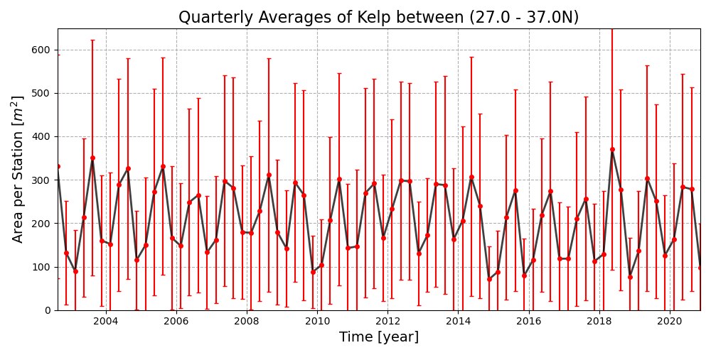
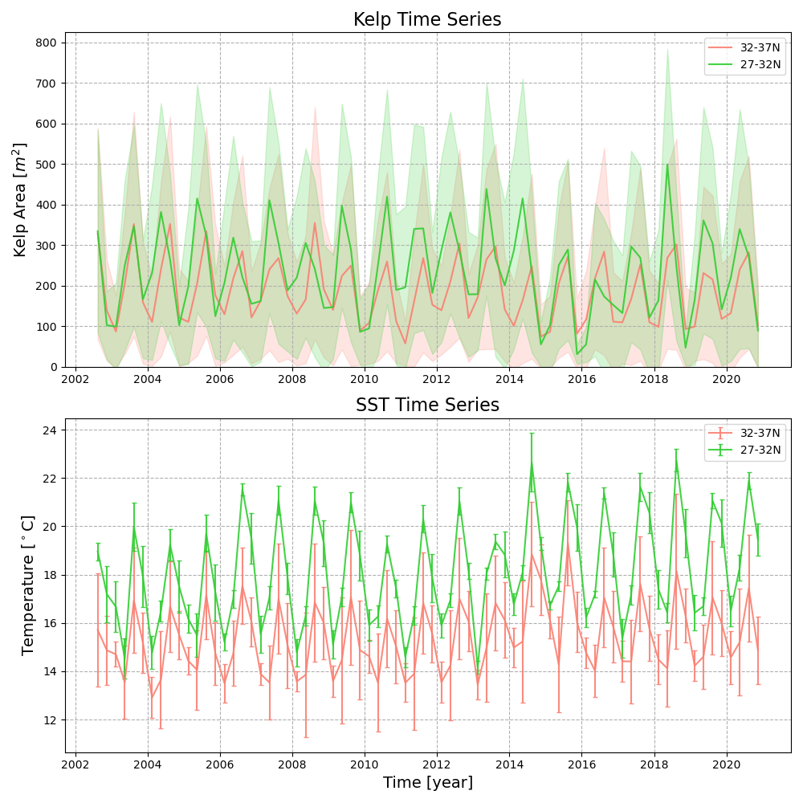

# Kelp Forest Monitoring

An ecological forecasting model for monitoring the biomass availability in kelp forests on the California coast. 


## Installation + Setup

1) Clone repo + setup a conda environment

```
conda create -n kelp python=3.10
conda activate kelp
conda install ipython jupyter pandas matplotlib scipy scikit-learn
conda install -c conda-forge xarray dask netCDF4 bottleneck
pip install tqdm statsmodels astropy
```

2) Download larges files from git lfs: 
    - `git lfs install`
    - `git lfs pull`

2) Download interpolated SST values
    - Go to https://hub.jpl-cmda.org
    - Navigate to `shared/notebooks/Kelp_Biomass/`
    - Download [kelp_interpolated_data.pkl (~3GB)](https://hub.jpl-cmda.org/user/kpearson/files/shared/notebooks/Kelp_Biomass/kelp_interpolated_data.pkl)

The interpolated data comes from `create_interpolated_sst.py` and interpolates the monthly SST data onto a quarterly grid to match the Kelp data. The interpolated data is saved as a pickle file and is used in `kelp_metrics.py` to calculate the lag temperatures and derivatives for a given latitude range.

3) Create some metrics/features, set the `lower_lat` and `upper_lat` variables in the script to change where the metrics are calculated
    - `python kelp_metrics.py`

The metrics script will create a new file called `kelp_metrics.pkl` which contains features for our regression algorithm.

4) Train a regression model (includes OLS, MLP and RF)
    - `python train_regressors.py`

## Analysis Scripts


| Script Name | Description | 
| ----------- | ----------- |
| `create_interpolated_sst.py` | Interpolate the monthly SST data onto the same grid as the kelp data and create a new file called: `kelp_interpolated_data.pkl` |
| `create_interpolated_sst_sim.py` | Interpolate the simulated monthly SST data onto the same grid as the kelp data(quarterly) and create a new file called: `kelp_interpolated_data_sim.pkl`   |
| `kelp_metrics.py` | Calculate various metrics like lag temps and derivatives for each kelp location then save the data to a new file called: `kelp_metrics.pkl`. These metrics are used as features for our regression algorithm. |
| `plot_timeseries.py` | Create time series plots for temperature and abundance using `kelp_metrics.pkl`, averages over the entire region. 
|  |  |
| `plot_histogram_sst.py` `plot_histogram_kelp.py`   | Create seasonal histograms for change in abundance using `kelp_metrics.pkl`, averages over the entire region. |
|  |  |
| `plot_lag_correlation.py` `plot_lag_correlation_change.py` | Create lag correlation plots for temperature and abundance using `kelp_metrics.pkl`, averages over the entire region. |
|  |  |
| `overplot_timeseries.py` | Create time series plots for temperature and kelp using `kelp_metrics.pkl`, overplots 3 different regions. |
| |  | |
| `overplot_histogram.py` | Create seasonal histograms for change in abundance and SST using `kelp_metrics.pkl`, overplots 3 different regions. |
|  |  |
| `trends_annual.py` | Calculate the annual trends for kelp abundance and temperature using `kelp_metrics.pkl`. Also, measures significance of trends with various pval estimates (e.g. pearsonr, Mann-Kendall, Kendall-Tau, ANOVA, Spearmanr, etc.) |
|  |  |
| `trends_quarterly.py` | Calculate the seasonal trends (quarterly) for kelp abundance and temperature using `kelp_metrics.pkl`. Also, measures significance of trends with various pval estimates (e.g. pearsonr, Mann-Kendall, Kendall-Tau, ANOVA, Spearmanr, etc.) |
| | Trend with previous quarter's temperature  | 
| `regressors_optimize.py` | Hyperparameter optimization for regression algorithms using scikit-learn | 
| `regressors_train.py` | Train various regression models to predict the abundance of Kelp using ordinary least-squares, multi-layer perceptron and random forest with features from `kelp_metrics.pkl`. |
|  |  |
| `regressors_predict.py` |  |

# Tests for statistical significance

| Annual P-Vals | SST vs. Kelp | Time vs. SST | Time vs. Kelp |
|--------------|--------------|--------------|--------------|
| [Pearsonr](https://docs.scipy.org/doc/scipy/reference/generated/scipy.stats.pearsonr.html)    | 0.149        | 0.001        | 0.053        |
| [Kendalltau](https://docs.scipy.org/doc/scipy/reference/generated/scipy.stats.kendalltau.html)  | 0.164        | 0.000        | 0.080        |
| [Spearmanr](https://docs.scipy.org/doc/scipy/reference/generated/scipy.stats.spearmanr.html)   | 0.198        | 0.000        | 0.058        |
| [Mann.Kendall](https://docs.scipy.org/doc/scipy/reference/generated/scipy.stats.mstats.kendalltau.html) | 0.164        | 0.000        | 0.080        |
| [Linregress](https://docs.scipy.org/doc/scipy/reference/generated/scipy.stats.linregress.html)  | 0.149        | 0.001        | 0.053        | 

Signficant p-vals are less than ~0.05-0.1, where smaller values are more significant. These values are measured in the `trends_annual.py` script.

| Quarterly P-vals| SST vs. Kelp | Time vs. SST | Time vs. Kelp |
|-----------------|--------------|--------------|---------------|
| Pearsonr        | 0.000        | 0.033        | 0.166         |
| Kendalltau      | 0.009        | 0.051        | 0.213         |
| Spearmanr       | 0.003        | 0.041        | 0.202         | 
| Mann.Kendall    | 0.009        | 0.051        | 0.213         |
| Linregress      | 0.000        | 0.033        | 0.166         |

One thing these tables don't show is the direction of the correction but from the quarterly plots above we see an inverse trend between Kelp and SST from a quarter before. The trend implies some at some temperature around ~22C the kelp abundance reaches 0.

| Quarterly P-vals | SST_lag vs. Kelp | Time vs. SST_lag | Time vs. Kelp |
|------------------|------------------|------------------|--------------|
| Pearsonr         | 0.000            | 0.094            | 0.295        |
| Kendalltau       | 0.000            | 0.092            | 0.346        |
| Spearmanr        | 0.000            | 0.065            | 0.333        |
| Mann.Kendall     | 0.000            | 0.092            | 0.346        |
| Linregress       | 0.000            | 0.094            | 0.295        |

### Pearson's correlation:
- Measures the linear relationship between two continuous variables 
- Produces a correlation coefficient (r) from -1 to +1
   - +1 is a perfect positive linear relationship
   - -1 is a perfect negative linear relationship 
- Also provides a p-value to test if the correlation is statistically significant

### Kendall's tau:
- Nonparametric test that looks at concordant and discordant pairs
- Concordant pairs are when both values increase or decrease together 
- Discordant pairs are when one value increases while the other decreases
- Tau coefficient indicates the net correlation of the concordant/discordant pairs
- Tau close to +1/-1 indicates a strong monotonic trend

### Mann-Kendall: 
- Nonparametric test specifically for monotonic upward or downward trends over time
- Compares each data point to all subsequent points 
- Positive differences indicate an upward trend, negative differences indicate downward 
- Statistical test on these differences determines if the trend is significant


### Spearman's Rank Correlation:
- Nonparametric measure of correlation between two variables
- Assesses monotonic relationship rather than linear 
- Converts data values to ranks before calculating coefficient
- Coefficient (r) ranges from -1 to +1
- Positive r means variables increase together 
- Negative r means one increases as other decreases
- r near zero means little to no association
- r of +1/-1 indicates perfect monotonic relationship
- Tests significance of r using a hypothesis test
- Produces a p-value to determine if correlation is significant
- Useful for non-normal distributions or nonlinear relationships
- Simple to calculate and interpret
- Less sensitive to outliers compared to Pearson correlation

### Linear Regression analysis:
- Fits a straight line model to the data 
- Tests if slope coefficient is significantly different than zero
- Slope significantly greater than zero indicates increasing trend
- Slope significantly less than zero indicates decreasing trend

# Temperature vs. Kelp Abundance per Region

The largest correlations with kelp abundace are the temperatures with a one quarter lag. The kelp decreases to 0 at an average temperature of ~23.47 +- 2.11C.

|  | 27 - 30N | 30 - 33N | 33 - 36N |
|-|-|-|-|
| Correlation coefficient | -0.16 | 0.45 | 0.32 |  
| Correlation coefficient for One Quater Lag | -0.78 | -0.64 | -0.82 |
| Correlation coefficient for Two Quarter Lag | 0.03 | -0.52 | -0.32 |
||||
| Slope of trend line (m^2/C) | -8.51 +- 6.32 | 15.70 +- 3.67 | 17.69 +- 6.27 |
| Slope of trend line with one quater lag (m^2/C) | -42.40 +- 4.04 | -21.09 +- 3.04 | -36.10 +- 2.99 |
| Slope of trend line with two quarters lag (m^2/C) | 1.51 +- 6.53 | -17.52 +- 3.45 | -11.58 +- 4.13 |
||||
| Temperature when kelp abundance is zero (C) | 45.93 +- 1682.29 | 6.37 +- 5.29 | 4.66 +- 22.76 |
| Temperature when kelp abundance is zero using a quarter lag (C) (T0) | 23.80 +- 3.04 | 26.12 +- 5.00 | 20.40 +- 2.10 |
| Temperature when kelp abundance is zero using 2 quarters lag (C) | -137.90 +- 1423.19 | 27.84 +- 7.83 | 31.45 +- 127.13 |
||||
| Year at which avg. temp reaches 23.47 +- 2.11C | 2055.37 +- 17.89 | 2070.05 +- 21.60 | 2139.78 +- 32.90 |
| Year at which avg. temp reaches T0 | 2058.10 +- 26.06 | 2097.48 +- 51.18 | 2091.29 +- 32.72 |

| | | |
|-|-|-|
| |  |  |
| |  |  |

# Predictions with Machine Learning

We test three different regression algorithms to predict the abundance of kelp: ordinary least-squares, multi-layer perceptron and random forest. The regressors are trained using the features from `kelp_metrics.pkl` and the target variable is the abundance of kelp. The regressors are trained using the `regressors_train.py` script.

|                      | Correlation Coefficient | Mutual Information | Feature Importance |
| -------------------- | ----------------------- | ------------------ | ------------------ |
| Time                 |  -0.032 | 0.155 | 0.027 |
| Elevation [m]        | 0.040   | 0.013 | 0.000 |
| Sunlight [day]       | 0.304   | 0.186 | 0.690 |
| Latitude             | 0.116   | 0.098 | 0.000 |
| Longitude            | -0.164  | 0.103 | 0.000 |
| Temperature          | 0.005   | 0.391 | 0.000 |
| Temperature Lag      | -0.314  | 0.420 | 0.199 |
| Temperature Lag 2    | -0.172  | 0.401 | 0.084 |


Even though the parameters individually may be correlated to the amount of kelp, the random forest regression model suggests only the amount of sunlight, temperature from the previous quarter and time are important for making a prediction. Making another model with only these features may be more accurate than includes features like elevation, latitude, longitude, etc.

|                         | Correlation Coefficient | Mutual Information | Feature Importances |
|-------------------------|-------------------------|--------------------|---------------------|
| Time                    | -0.042                  | 0.155              | 0.020               |
| Sunlight [day]          | 0.304                   | 0.186              | 0.702               |
| Temperature Lag         | -0.314                  | 0.420              | 0.194               |
| Temperature Lag 2       | -0.172                  | 0.401              | 0.085               |

# Datasets

We use various data sets including kelp biomass, sea surface temperature, and digital elevation models.

## Kelp Biomass

[Kelp Watch](https://kelpwatch.org/) is an online platform that provides access to satellite data on kelp canopy dynamics along the west coast of North America. Developed through a collaboration between researchers and conservation groups, Kelp Watch uses Landsat imagery to quantify seasonal giant kelp and bull kelp canopy area in 30x30m regions spanning from Baja California, Mexico to Oregon since 1984. The interactive web interface allows users to visualize, analyze, and download the kelp canopy data to support research and inform management decisions. Key applications include assessing long-term trends, impacts of disturbances like marine heatwaves, and local kelp forest dynamics. Overall, Kelp Watch makes complex satellite data more accessible to better understand and manage these valuable kelp forest ecosystems. The Kelp Watch project monitors ~500,000 locations along the west coast.

Data URL: https://sbclter.msi.ucsb.edu/data/catalog/package/?package=knb-lter-sbc.74


`kelp_area_m^2` - The total emergent kelp canopy area in square meters within the selected geometry. Cells with no numerical value correspond to instances when the scene was either obstructed by clouds and/or no clear observation of the area was available and no measurement was obtained. The nan's and zeros should be filtered out in correlation estimates.


| Quarter | Season        | Months                  | Date              |
| ------- | ------------- | ----------------------- | ----------------- |
| Q1      | winter        | January – March         | 02-15T00:00:00.00 |
| Q2      | spring        | April – June            | 05-15T00:00:00.00 |
| Q3      | summer        | July – September        | 08-15T00:00:00.00 |
| Q4      | fall          | October – December      | 11-15T00:00:00.00 |


## Sea Surface Temperature

We use the [JPL MUR SST](https://podaac.jpl.nasa.gov/dataset/MUR-JPL-L4-GLOB-v4.1) data set to get the sea surface temperature data. The data for this project are monthly averages of the SST at 0.01 deg resolution. For more information see [Kalmus et al. 2022](https://agupubs.onlinelibrary.wiley.com/doi/full/10.1029/2021EF002608)


## Digital Elevation Models

GEBCO - https://www.gebco.net/data_and_products/gridded_bathymetry_data/ (sub-ice topo/bathy; 15 arc-second resolution)

NOAA - https://www.ncei.noaa.gov/products/coastal-relief-model (Southern California Version 2; 1 arc-second resolution)


## To Do
- Compute T0 for N/S region, 3 regions is too noisy in middle
- Change from mean kelp prediction to max kelp prediction (2 output MLP or OLS?)
- maximum area in each location vs time series, annual max?